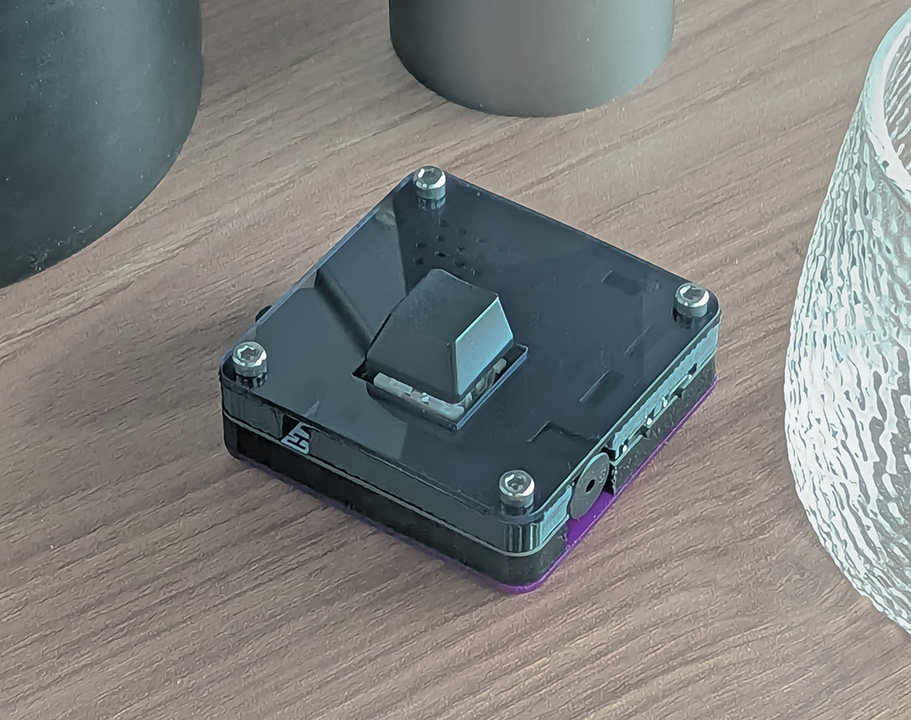

# HAM-Key
一个单按键摩斯码蓝牙键盘

## 简介

`HAMKey`是一个与摩斯码密切相关的键盘项目。旨在为业余无线电爱好者和对摩斯码感兴趣的人群提供一个便利的输入外设。

本分支为`HAMKey-Lite`的主仓库。

## 实物图

## 用法

见 [固件仓库](https://github.com/Nigh/HAMKey-firmware/tree/lite)

## 鸣谢

感谢下列早期赞助者，是他们的支持使得这个项目得以成功启动

`Laechln`，`处处连续不可导`，`威斯特里斯港`，`missyou-----`，`derouan`，`bili_83894624857`，`南岛泉客`，`七E7`，`petalgem`

